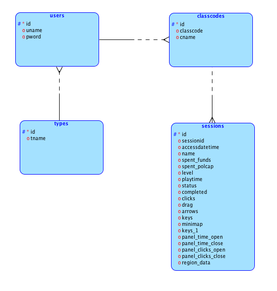
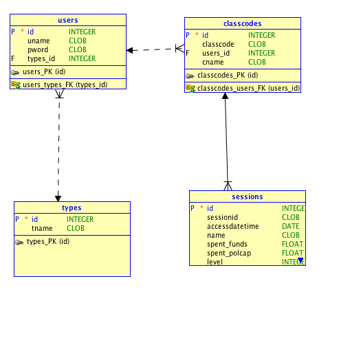

# Environ Control Panel Interface (CPI) 

This is an MVC web app to play, promote, and manage Environ. Admins and educators can log in to create class codes to have users play and track their activity for grading and gameplay/ui evaluation. 

This web app applies a modification of the [Descartes Framework](https://github.com/samueleishion/Descartes "Descartes PHP Framework") at least for now. 

## Directory Tree 

+ __controllers__
	+ __libs__
        +  *functions.php*: has global functions: clean, encode, now, encodequotes, etc. 
        +  *html.php*: has html wrappers like header, footer, navigation bar, etc. 
    + *controller.php*: handles url patterns given by .htaccess on root. 
    + *operator.php*: handles data transfer/connection requests. works as a private api. 
    + *settings.php*: handles database connection, path information and session initiation. 
+ __models__: holds the models for the application. 
+ __static__: holds static files. scripts, styles, images, etc. 
+ __views__: holds views for the application. 


## Database Structure 

### Logical Model
There are a total of 4 models so far. The interaction is as follows: 

 

### Relational Model
The following model shows more concrete relationships with foreign keys: 

 

### DDL
```
CREATE
  TABLE classcodes
  (
    id int NOT NULL,
    classcode text NOT NULL,
    users_id int NOT NULL,
    cname text NOT NULL, 
    PRIMARY KEY (`id`) 
  ) ENGINE=InnoDB DEFAULT CHARSET=latin1 AUTO_INCREMENT=1;

CREATE
  TABLE sessions
  (
    id int NOT NULL,
    sessionid text NOT NULL,
    accessdatetime datetime NOT NULL,
    name text NOT NULL,
    spent_funds float NOT NULL,
    spent_polcap float NOT NULL,
    last_level int NOT NULL,
    playtime float NOT NULL,
    status    int NOT NULL,
    completed int NOT NULL,
    clicks text NOT NULL,
    drag    int NOT NULL,
    arrows  int NOT NULL,
    wasdkeys    int NOT NULL,
    minimap int NOT NULL,
    numkeys  int NOT NULL,
    panel_time_open float NOT NULL,
    panel_time_close float NOT NULL,
    panel_clicks_open  int NOT NULL,
    panel_clicks_close int NOT NULL,
    region_data text NOT NULL,
    classcodes_id int NOT NULL, 
    PRIMARY KEY (`id`) 
  ) ENGINE=InnoDB DEFAULT CHARSET=latin1 AUTO_INCREMENT=1;

CREATE
  TABLE types
  (
    id int NOT NULL,
    tname text, 
    PRIMARY KEY (`id`) 
  ) ENGINE=InnoDB DEFAULT CHARSET=latin1 AUTO_INCREMENT=1;

CREATE
  TABLE users
  (
    id int NOT NULL,
    uname text NOT NULL,
    pword text NOT NULL,
    types_id int, 
    PRIMARY KEY (`id`) 
  ) ENGINE=InnoDB DEFAULT CHARSET=latin1 AUTO_INCREMENT=1;

ALTER TABLE classcodes ADD CONSTRAINT classcodes_users_FK FOREIGN KEY (
users_id ) REFERENCES users ( id ) ;

ALTER TABLE sessions ADD CONSTRAINT sessions_classcodes_FK FOREIGN KEY (
classcodes_id ) REFERENCES classcodes ( id ) ;

ALTER TABLE users ADD CONSTRAINT users_types_FK FOREIGN KEY ( types_id )
REFERENCES types ( id ) ;
```