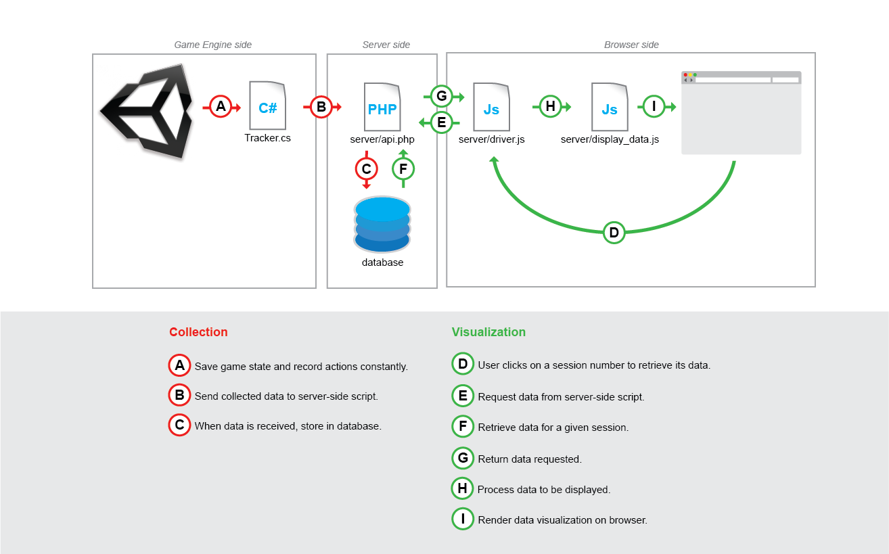

# Environ CPI (Control Panel Interface) 

**Purpose**: In its relation to Environ, its purpose is to visualize the collected data per gameplay session. In its general design, this is a multipurpose web-app. 

* [Branches](#branches)
* [Flow](#flow) 
    * [Directory Tree](#directory-tree) 
    * [Site Flow](#site-flow) 
    * [Tracker Workflow](#tracker-workflow) 
* [Front-end Structure](#front-end-structure) 
    * [Visualization](#visualization) 
    * [Static files](#static-files)
    * [Game](#game) 
* [Back-end Structure](#back-end-structure)
    * [Settings](#settings) 
    * [Models](#models) 
    * [Views](#views) 
    * [Controllers](#controllers) 
        * [Main controller](#main-controller) 
        * [Opreator](#operator-controller) 
        * [API controller](#api-controller) 
* [Database Structure](#database-structure) 
    * [Logical Model](#logical-model) 
    * [Relational Model](#relational-model) 
    * [DDL](#ddl)


This is an MVC web app to play, promote, and manage Environ. Admins and educators can log in to create class codes to have users play and track their activity for grading and gameplay/ui evaluation. 

This web app applies a modification of the [Descartes Framework](https://github.com/samueleishion/Descartes "Descartes PHP Framework") at least for now. 

## Branches
- **development**: 
    - Changes that happen on the development stage. 
    - Assumes only one person working on development. 
    - Merge with master when ready for production. 
- **master**: Changes ready for production 

## Flow
##### Directory Tree
- [__controllers__](#controllers)
    - __libs__
        -  *functions.php*: has global functions: clean, encode, now, encodequotes, etc. 
        -  *html.php*: has html wrappers like header, footer, navigation bar, etc. 
    - [*controller.php*](#main-controller): handles url patterns given by .htaccess on root. 
    - [*operator.php*](#operator-controller): handles data transfer/connection requests. works as a private api. 
    - [*settings.php*](#settings): handles database connection, path information and session initiation. 
- [__models__](#models): holds the models for the application. 
- [__static__](#static-files): holds static files: scripts, styles, images, etc. 
- [__views__](#views): holds views for the application. 
 
##### Site Flow 
 

##### Tracker Workflow
 

## Front End Structure 
#### Visualization 
##### STEP D
When the `driver.js` file is loaded into the DOM, it loads the different courses a user can select from by calling `load_menu();`. Once a course has been selected, this function then calls `load_menu_options(ccid);` with that courses' id to load all session that pertain to it. These sessions are only the session ids that are displayed in the left menu. This step represent the user clicking a session number to load its data. 

##### STEP E
When one of these session ids is clicked, the browser performs and ajax request to load the session data. This is a brief code abstract to illustrate Steps D and E: 
```js
$(document).ready(function() {
    load_menu(); 
    
    $('body').on('click','.subnav .menuoptions li', function() {
        var id = $(this).attr('id'); // session id contained in clicked menu item 
        $.ajax({
            type: 'GET', 
            url: APPURL, // APPURL is the api's url, defined on first lines of driver.js
            data: {
                // API action "pull" to pull data from database. 
                // More about this request on steps F and G
                action: 'pull', 
                id:id
            }, 
            success: function(data) {
                // Display data returned from request 
                // More about this on steps H and I
                display_data(); 
            }
        }); 
    }); 
}); 

function load_menu() {
    ...
    load_menu_options($(this).val()); 
    ...
}; 

function load_menu_options(ccid) {
    ...
    $('.subnav .menuoptions').append('<li id="'+sessionid+'">'+sessionid+'</li>'); 
    ...
}; 
```

##### STEP F
Like mentioned on **Step C** on the [Data Collection documentation](https://github.com/UTCTL/Environ/tree/master/Assets/Scripts/EnvironModules/Tracker#step-c), the API script works as a controller with a switch statement to process separate requests. In this case, we are sending a "`pull`" via ajax. All we do in `pull` is return a json representation of the sessions data. To do this we instantiate a new session with the given session id, and then we call its `toJson()` method. 
```php
$action = clean($_GET['action']); // getting the action from the request call 
switch($action) {
    case 'pull':
        $s = new Session($dblink); // $dblink is the connection to the database 
        $s->instantiateById($sessionid); 
        echo $s->toJson(); 
        break; 
}
```

##### STEP G
**Step G** was actually already explained in **Step F**, so here we are just going to go over how `GET` requests work in this particular context. If you are pretty comfortable with `GET`/`POST` requests, you can skip this step. 

To understand how the server-side script (`api.php`) receives the ajax request we will briefly go over the `$_GET`, `$_POST`, and `$_REQUEST` variables. As mentioned on the [Data Collection documentation](https://github.com/UTCTL/Environ/tree/master/Assets/Scripts/EnvironModules/Tracker#step-c), the way php deals with requests (at least for our purposes) can get either `GET` or `POST`. The main difference is that `GET` can be seen by anybody, while `POST` can't. For instance: A `GET` request can be easily built by attaching parameters to the script url. I.e./ `server/api.php?action=pull&sessionid=1`. For a `POST` request, you can send in the same parameters but the url will not change. I.e./ `server/api.php`. 

In order to retrive the sent infromation in your script, you have to access the `$_GET` associative array if it was a `GET` request, and `$_POST` if it was a `POST` request. If you are unsure of what type of request was sent, you can still access the data through the `$_REQUEST` associative array. So for the above example, we can access the data like so:
```php
echo $_GET['action']; // "pull"
echo $_GET['sessionid']; // 1
echo $_REQUEST['action']; // "pull" 
echo $_REQUEST['sessionid']; // 1
```

To return the data from the back-end (API) to the ajax call from the front-end in PHP all you have to do to send data back from an ajax request is print a string. In our case we are `echo`ing `$s->toJson();`. To catch it back on the ajax request, we call the success function: 
```js
$.ajax({
    type:'GET',  
    url:'server/api.php',
    data: {
        action:"pull", 
        sessionid:2
    }, // these parameters will compose the GET url: server/api?action=pull&sessionid=1
    success: function(data) {
        // in this case, data contains
        // "pull12pull2" since that's what being "echoed" by the previous script
        console.log(data); 
    }
}); 
```

##### STEP H
Since **Step F/G** returns a json string, we first need to parse it to get a json dictionary. If this dictionary contains a _success_ message then we set the global variable `session` to the successful data. We then call the `display_data()` function to render the data on the browser. 
```js
// Same request indicated on Step E 
$(document).ready(function() {
    $('body').on('click','.subnav .menuoptions li', function() {
        var id = $(this).attr('id'); // session id contained in clicked menu item 
        $.ajax({
            type: 'GET', 
            url: APPURL, // APPURL is the api's url, defined on first lines of driver.js
            data: {
                action: 'pull', 
                id:id
            }, success: function(data) {
                var j = $.parseJSON(data); 
                if(j.hasOwnProperty("success")) {
                    session = j["data"][id]; 
                    // More on display_data() on Step I
                    display_data(); 
                }  
            }
        }); 
    }); 
}); 
```

##### STEP I

For this step we will focus on the `display_data.js` file. In it, we find `display_data()` which processes the session data to display it. Most of the things we access are pretty straight forward: 
```js
// displaying spent funds and political capital for selected session. 
$('.meta #funds b').html(session["details"]["spent_funds"]); 
$('.meta #pc b').html(session["details"]["spent_polcap"]); 
```

From here on, the visualization depends on accessing the data through the session global cariable. 

#### Static Files 
#### Game

## Back End Structure

#### Settings 

There are 7 variables that should be set to get the site running on any server. 
* `$sitename`: The name of the site or brand. 
* `$siteurl`: The domain for the website. 
* `$dbhost`: The database host. 
* `$dbuser`: The username for the database. 
* `$dbpass`: The password for the database. 
* `$dbname`: The database name. 
* `$_SESSION['DESpath']`: The path in your server to reach this site. This variable currently requires `$sitename` to be properly set for two reasons: 
    * This variable assumes `$sitename` to be the name of the websites' directory. 
    * It's important to set this site on its own server, especially if you plan to have multiple Descartes-based projects on the server. 
    * This variable can also be reset to any other path you choose (without having to use `$sitename`). 

To better illustrate `$_SESSION['DESpath']`:
```php
$sitename = 'MYSite'; 
$_SESSION['DESpath'] = '/'.$sitename.'/'; 
/* assumes website is located at serverroot/MYSite */
```

#### Models
In a typical MVC style web site your models not only represent the pages' information but more importantly, they are an object-oriented representation of the database's tables. On our particular case, we have 4 models: 
* `User`: allows the front end to easily handle user actions (log in, log out, edit, delete, etc). 
* `UserType`: smaller class in the `User` model file that allows us to distinguish what type of user is a given user (educator/admin) 
* `Session`: allows the front end and the api to easily handle sessions (load data, save data, store temporary data, etc). 
* `Classcode`: smaller class in the `Session` model file that allows us to store sessions based on corresponding classes/courses. 


#### Views
The views are the html web pages that the user gets to see. Their main function is to load the data by calling the models and render it with html. There are 5 views so far: 
* `About`: consists of the About page. It loads no models. 
* `Home`: consists of the Home page. It does discriminate between users to show different content: 
    * If user is not logged in, it shows the splash page. This case loads no models. 
    * If user is logged in and it's an educator, it redirects to the `Tracker` view (_report_ page). 
    * If user is logged in and it's an admin, it shows the admin panel. This case loads the `User` model. 
* `Login`: consists of the login form page. It loads no models. 
    * If the user is logged in, it redirects to the _home_ page. 
* `Play`: consists of the page with the game. It loads no models. 
* `Tracker`: consists of the Tracker data visualization. It loads no models. 
    * This parts doesn't load any models because the data is dynamically loaded via ajax requests. For more information check out the [Front End's Visualization](#visualization) and the [Operator Controller](#operator-controller) sections. 

#### Controllers 
##### Main controller 
This controller is in charge of routing the input from the urls into the proper view. Via the `.htaccess` file, the `GET` variable is defined at `view`: 
```
RewriteRule ^([a-zA-Z0-9\-]+)$ index.php?view=$1 
```
So on php, we filter that `view` to display a particular view like so: 
```php
$view = $_GET['view']; 
switch($view) {
    case 'about':
        require_once('views/view.About.php'); 
        break; 
}
```
##### Operator controller
This controller is an internal controller: it is used to handle requests from within the sites like loading menu or internal data. For exampls it's used in `main.js` to log in and/or out. 

##### API Controller 
This controller is an external controller: it is used to handle requests from third party developers. It is, nevertheless, highly suggested to restrict who accesses the `api.php` script by modifying the `Access Controll Allow Origin` header to only allow access to the same site's server tand the game-hosting server: 
```php
header('Access-Control-Allow-Origin: http://siteserver.com'); 
header('Access-Control-Allow-Origin: http://gameserver.com'); 
```

For more information on how the back-end works, take a look at the [Descartes Framework documentation](https://github.com/samueleishion/Descartes "Descartes PHP Framework")

## Database Structure

#### Logical Model 
There are a total of 4 models so far. The interaction is as follows: 

 

#### Relational Model 
The following model shows more concrete relationships with foreign keys: 

 

#### DDL
```
CREATE
  TABLE classcodes
  (
    id int NOT NULL,
    classcode text NOT NULL,
    users_id int NOT NULL,
    cname text NOT NULL, 
    PRIMARY KEY (`id`) 
  ) ENGINE=InnoDB DEFAULT CHARSET=latin1 AUTO_INCREMENT=1;

CREATE
  TABLE sessions
  (
    id int NOT NULL,
    sessionid text NOT NULL,
    accessdatetime datetime NOT NULL,
    name text NOT NULL,
    spent_funds float NOT NULL,
    spent_polcap float NOT NULL,
    last_level int NOT NULL,
    playtime float NOT NULL,
    status    int NOT NULL,
    completed int NOT NULL,
    clicks text NOT NULL,
    drag    int NOT NULL,
    arrows  int NOT NULL,
    wasdkeys    int NOT NULL,
    minimap int NOT NULL,
    numkeys  int NOT NULL,
    panel_time_open float NOT NULL,
    panel_time_close float NOT NULL,
    panel_clicks_open  int NOT NULL,
    panel_clicks_close int NOT NULL,
    region_data text NOT NULL,
    classcodes_id int NOT NULL, 
    PRIMARY KEY (`id`) 
  ) ENGINE=InnoDB DEFAULT CHARSET=latin1 AUTO_INCREMENT=1;

CREATE
  TABLE types
  (
    id int NOT NULL,
    tname text, 
    PRIMARY KEY (`id`) 
  ) ENGINE=InnoDB DEFAULT CHARSET=latin1 AUTO_INCREMENT=1;

CREATE
  TABLE users
  (
    id int NOT NULL,
    uname text NOT NULL,
    pword text NOT NULL,
    types_id int, 
    PRIMARY KEY (`id`) 
  ) ENGINE=InnoDB DEFAULT CHARSET=latin1 AUTO_INCREMENT=1;

ALTER TABLE classcodes ADD CONSTRAINT classcodes_users_FK FOREIGN KEY (
users_id ) REFERENCES users ( id ) ;

ALTER TABLE sessions ADD CONSTRAINT sessions_classcodes_FK FOREIGN KEY (
classcodes_id ) REFERENCES classcodes ( id ) ;

ALTER TABLE users ADD CONSTRAINT users_types_FK FOREIGN KEY ( types_id )
REFERENCES types ( id ) ;
```
