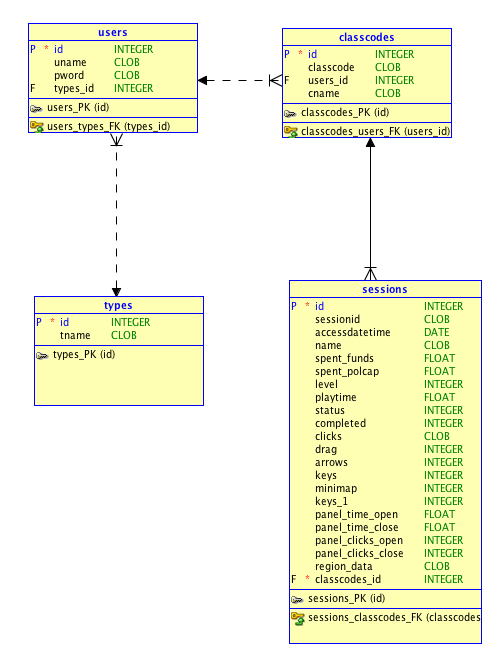

# Environ Control Panel Interface (CPI) 

This is an MVC web app to play, promote, and manage Environ. Admins and educators can log in to create class codes to have users play and track their activity for grading and gameplay/ui evaluation. 

This web app applies a modification of the [Descartes Framework](https://github.com/samueleishion/Descartes "Descartes PHP Framework") at least for now. 

## Directory Tree 

+ __controllers__
	+ __libs__
        +  *functions.php*: has global functions: clean, encode, now, encodequotes, etc. 
        +  *html.php*: has html wrappers like header, footer, navigation bar, etc. 
    + *controller.php*: handles url patterns given by .htaccess on root. 
    + *operator.php*: handles data transfer/connection requests. works as a private api. 
    + *settings.php*: handles database connection, path information and session initiation. 
+ __models__: holds the models for the application. 
+ __static__: holds static files. scripts, styles, images, etc. 
+ __views__: holds views for the application. 


## Database Structure 

### Logical Model
There are a total of 4 models so far. The interaction is as follows: 

 

### Relational Model
The following model shows more concrete relationships with foreign keys: 

 

### DDL
```
CREATE
  TABLE classcodes
  (
    id INTEGER NOT NULL ,
    classcode CLOB ,
    users_id INTEGER ,
    cname CLOB
  ) ;
ALTER TABLE classcodes ADD CONSTRAINT classcodes_PK PRIMARY KEY ( id ) ;

CREATE
  TABLE sessions
  (
    id INTEGER NOT NULL ,
    sessionid CLOB ,
    accessdatetime DATE ,
    name CLOB ,
    spent_funds FLOAT ,
    spent_polcap FLOAT ,
    "level" INTEGER ,
    playtime FLOAT ,
    status    INTEGER ,
    completed INTEGER ,
    clicks CLOB ,
    drag    INTEGER ,
    arrows  INTEGER ,
    keys    INTEGER ,
    minimap INTEGER ,
    keys_1  INTEGER ,
    panel_time_open FLOAT ,
    panel_time_close FLOAT ,
    panel_clicks_open  INTEGER ,
    panel_clicks_close INTEGER ,
    region_data CLOB ,
    classcodes_id INTEGER NOT NULL
  ) ;
ALTER TABLE sessions ADD CONSTRAINT sessions_PK PRIMARY KEY ( id ) ;

CREATE
  TABLE types
  (
    id INTEGER NOT NULL ,
    tname CLOB
  ) ;
ALTER TABLE types ADD CONSTRAINT types_PK PRIMARY KEY ( id ) ;

CREATE
  TABLE users
  (
    id INTEGER NOT NULL ,
    uname CLOB ,
    pword CLOB ,
    types_id INTEGER
  ) ;
ALTER TABLE users ADD CONSTRAINT users_PK PRIMARY KEY ( id ) ;

ALTER TABLE classcodes ADD CONSTRAINT classcodes_users_FK FOREIGN KEY (
users_id ) REFERENCES users ( id ) ;

ALTER TABLE sessions ADD CONSTRAINT sessions_classcodes_FK FOREIGN KEY (
classcodes_id ) REFERENCES classcodes ( id ) ;

ALTER TABLE users ADD CONSTRAINT users_types_FK FOREIGN KEY ( types_id )
REFERENCES types ( id ) ;
```